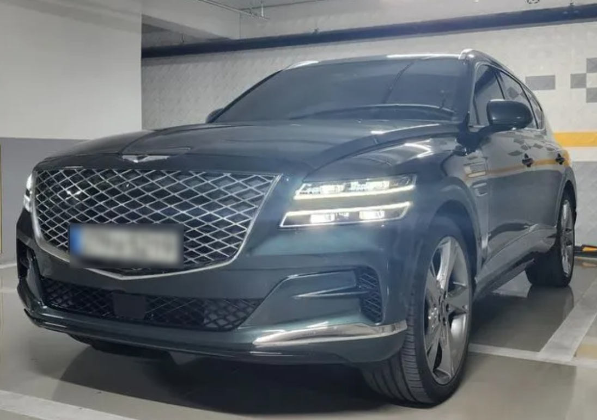
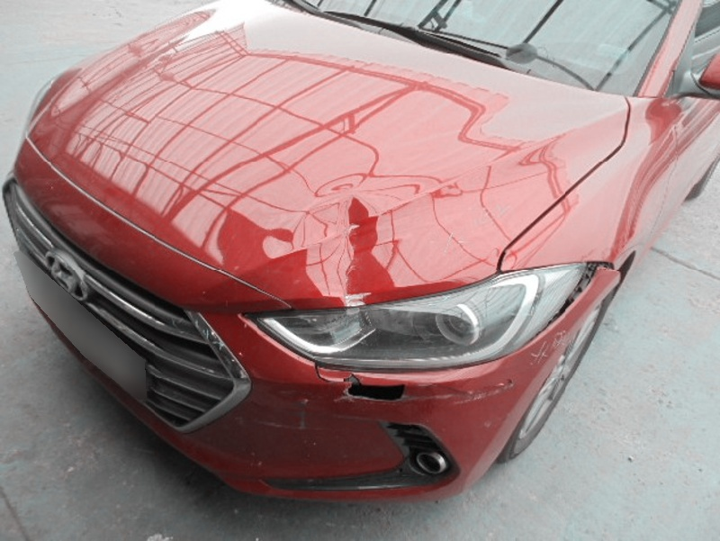
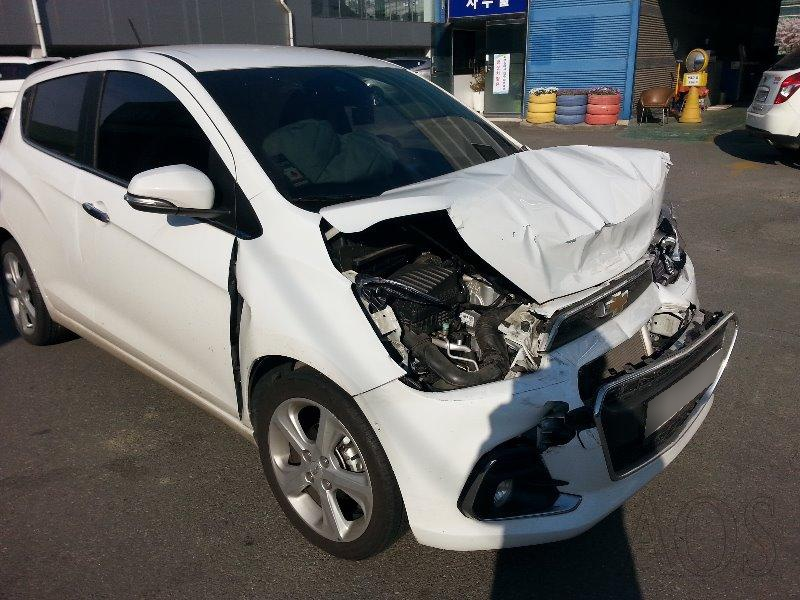
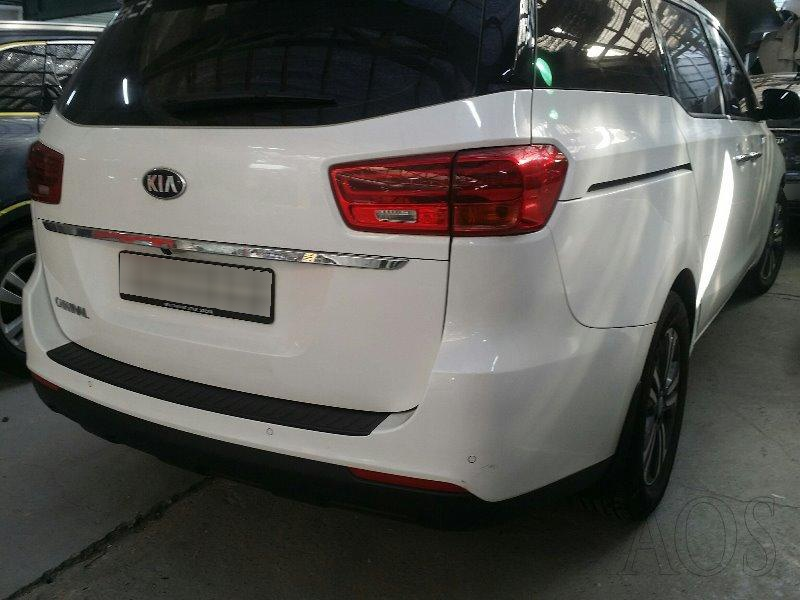
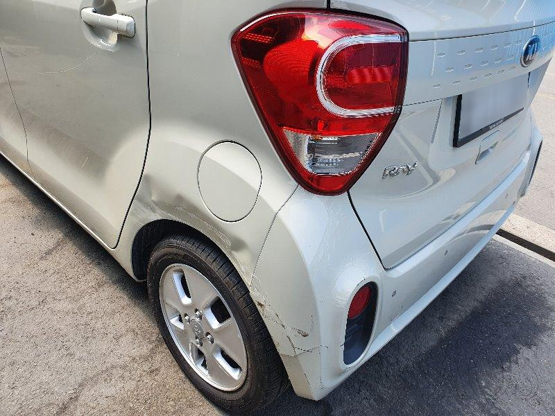
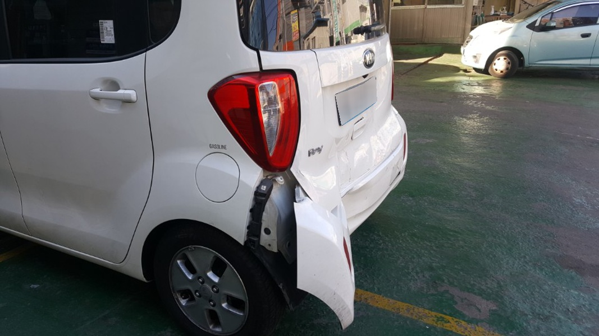

### Vehicle Detection App
This app allows you drag and drop an image of a car and it will tell you what kind of damage it has. The model is trained on third quarter front and rear views hence the picture should capture the third quarter front or rear view of a car.


### Model Details
1. Used RestNet50 for transfer Learning
2. Model was trained on 1725 images with 6 target classes 
   1. Front Normal
   2. Front Crushed
   3. Front Breakage
   4. Rear Normal
   5. Rear Crushed
   6. Rear Breakage
3. The Accuracy on Validation-Set was around 81.57%

### Setup 
1.  To get started, first install the dependencies using

      ```commandline
      pip install -r requirements.txt
      ```

   2. Run the stearmlit app
      go to respective folder 
   
      ``` commandline
      run streamlit run main.py"
      ```
### Architecture 
