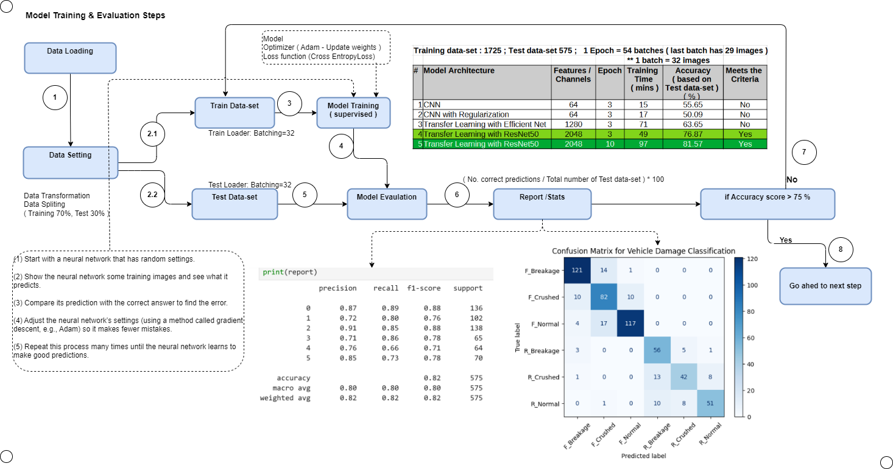
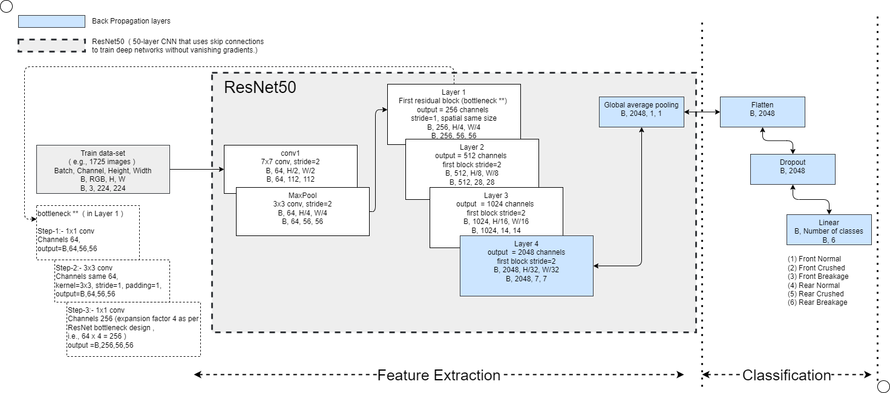

### Vehicle Damage Detection App
This app allows you drag and drop an image of a car and it will tell you what kind of damage it has. The model is trained on 3/4 th "front & rear views" of a car. So, the picture should capture in the same view. 


### Model Details
1. Used CNN (Convolutional Neural Network). This is good at processing images. 
2. Used RestNet50 for transfer Learning
3. Model was trained on 1725 images with 6 target classes 
#### Six Target classes along with sample image
| 1.Front Normal                    | 2.Front Crushed                    | 3.Front Breakage                   |
|-----------------------------------|------------------------------------|------------------------------------|
|  |  |  |
<br>
| 4.Rear Normal                      | 5.Rear Crushed                     | 6.Rear Breakage                   |
|------------------------------------|------------------------------------|-----------------------------------|
|  |  |  |

The Accuracy on Validation-set (Test-dataset) was around 81.57%


### Setup 
1.  To get started, first install the dependencies using

      ```commandline
      pip install -r requirements.txt
      ```

   2. Run the stearmlit app
      go to respective folder 
   
      ``` commandline
      run streamlit run main.py"
      ```
### Damage Prediction 


### Model Creation & Evaluation steps


### Core Model ( Architecture ) 


### Steps involved in Core Model 


### Some interesting predictions
#### Scenario-1 

Though, we provided flat front, it predicted well.

Takeaway:- 
1.  May be "features" involved in identifying "Front Normal" works well. Still, we have to try with similar images and make sure, it works fine or not :-)


#### Scenario-2

This image is perfect "Rear Normal", but it was predicted as "Rear Breakage"
    
Takeway:- 
1.  As a humans, we know Mother and Kid sitting at Rear side of the car. But Model considers "that portion of the pixel" as "Breakage"
2. Good thing is, it predicted well, the first part as "Rear"
3. Generally, if someone want to assess the damage, "Only car should be there. No passengers or No other objects". 
